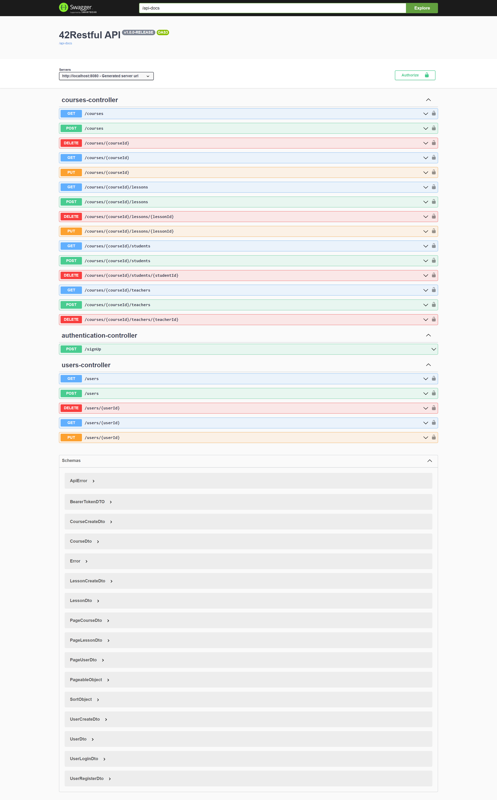
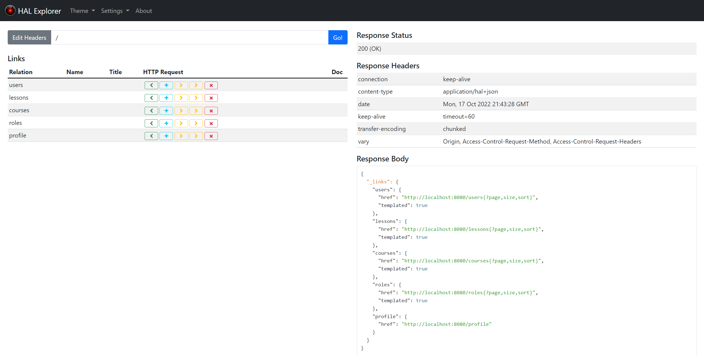
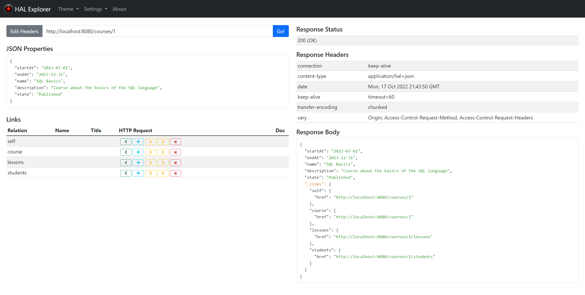

<h1 align="center">Restful</h1>
<p align="center">
RESTful API for training center: courses, students, teachers and lessons. Built on HATEOAS architecture.
</p>

<p align="center">
	
	
</p>

<br/>

## :package:  Technology stack

* Spring
* Spring Boot
* Spring Data JPA
* Spring Data REST + HAL Browser
* Spring REST Docs + Mock MVC
* Asciidoctor Maven Plugin
* H2 Database
* Mapstruct
* Lombok

## :ledger:  Features

* Training center CRUD operations for courses, users and lessons
* HATEOAS REST API architecture
* HAL Browser
* REST Docs
* Auto-generated documentation in HTML based on unit tests
* hal+json messages format

## :zap:  Quick start

**Step I:** Make sure you have JDK 1.8+ and Maven installed

**Maven basic endpoints:**

```bash
-- Compile, build and run the application
$> mvn spring-boot:run

-- Package the application and generate documentation
$> mvn package

-- Clean target folder which is created after build
$> mvn clean
```

<br/>

## :factory: Screenshots

**Swagger - Home page (ex00/ex01 branches)**



<br/><br/>

**HAL Browser - Home page**



<br/><br/>

**HAL Browser - Home page**



<br/><br/>